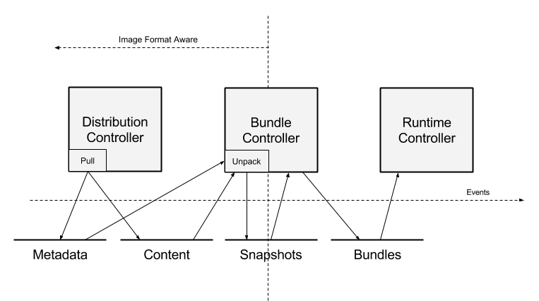

## Data flow

这篇文章是翻译官网**Data-Flow**文章.

再过去, 容器系统隐藏了拉取镜像的复杂性和细节.  这边文章介绍了从用户角度使用**Pull**操作后的一系列流程和操作. 在这个工作流中我们目标对象称为*bundle*, 然后从后往前来描述这个过程, 如何拉取镜像和为这个镜像做*bundle*.

在containerd, 我们重新定义了*pull*操作包含之前容器引擎的相同步骤.  这种情况下, 镜像包含创建 *bundle* 的资源集合. *Pull* 操作的目标是产生一系列步骤来解析镜像中的资源, 在这个流程中提供了多个生命周期点.

containerd中有完整的客户端侧*Pull*的实现, 但可能没有一个*Pull* api调用.

下面是一个粗略的数据流图和相关组件:



虽然数据流的方向是从左到右,但是本文档是从右到左介绍的. 

## Running container

对于containerd, 通常有一个叫做*bundle*的目录文件, 包括运行容器的文件系统和配置. 其大致如下格式:

```json
config.json
rootfs/
```

config.json 是用于配置runc的配置文件.
rootfs 是设置容器运行时的文件系统目录.

containerd并没有镜像的概念, 但是可以从镜像构建这种结构, 然后将其投入到containerd中.

基于此, 我们可以说运行容器的要求是执行一下操作:

1. 将镜像中的配置转换为运行container的目标格式.
2. 从镜像中重现rootfs. 可以同过解压和挂载两个方式.

## Create bundle

现在我们来创建一个*bundle*,  以下步骤:

```
ctr run ubuntu
```

它并不会拉取镜像, 仅仅拿着名称创建一个*bundle*,  以下是流程:

1. 在 metadata store 中查找镜像的digest.
2. 解析content store 中的 menifest.
3. 解析snapshot 系统中的每一层 snapshot.
4. 将配置装换为*bundle*的目标格式.
5. 为容器的rootfs创建运行时快照, 包括mount挂载.
6. 运行容器.

由此, 我们可以知道拉取镜像所需要的资源.

1. metadata store 中存储的数据指向特定的digest.
2. menifest 必须是在content store 中可用.
3. The result of successively applied layers must be available as a snapshot.

## Unpacking Layers

虽然这个行为可能是通过`pull`或者`run`.对于每一层，将结果应用于前一层的快照,这个结果是存储生成应用程序的chain id 下.

## Pull image

有了以上的定义, 拉取镜像变成了以下的步骤：

1. 获取镜像的menifest, 验证并存储.
2. 获取镜像每一层的menifest, 验证并存储.
3. 将menifest, degist 存储在提供的名称下.


