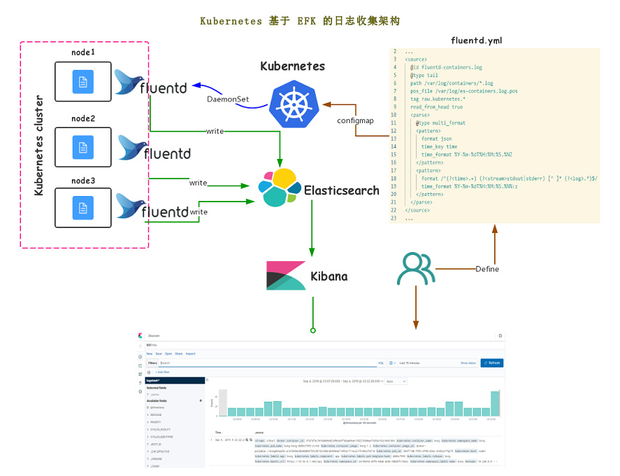

#### Kubernetes 的架构
- kube-apiserver
	- 提供restful风格的http服务, 用于存储k8s中的元数据,是唯一一个和etcd交互的组件. 
- etcd
	- 保存k8s中所有集群数据的数据库, 一个key-value类型的数据库.
- kube-controller-manger
	- 是一个资源控制器, 维护资源(如:Deployment, Service)到期望状态, 根据不通的资源类型有着不通的功能.
- kube-scheuler
	- 负责监听创建的pod调用到那台Node中运行.
- kube-proxy
	- 运行在每个Node中, 管理和实现Service资源的功能.
- kubelet
	运行在每台Node中, 管理pod中的容器并确保容器都是健康状态.
- kubectl
	- 和k8s交互的客户端组件.
- coredns
	- 集群内的DNS解析服务.

## 计算

#### 容器实现原理

###### cgroup

Cgroups全称Control Groups，是Linux内核提供的物理资源隔离机制，通过这种机制，可以实现对Linux进程或者进程组的资源限制、隔离和统计功能。

###### namespace

Linux Namespace是Linux提供的一种内核级别环境隔离的方法, 提供了对UTS、IPC、mount、PID、network、User等的隔离机制。

#### kube-scheduler 调度策略

请参考[kube-scheduler调度解析](https://github.com/misstick86/my_blog/tree/master/k8s/Kube-scheduler)

#### containerd 的架构

containerd 是一个标准的容器运行时管理工具, 并提供标的CRI接口供k8s调用.

请参考: [containerd手册](https://github.com/misstick86/my_blog/tree/master/containerd)

#### CRI 接口

从图中可以看出CRI是一个kubelet和容器管理平台的中间层, CRI本地定义了许多和容器、镜像操作的接口.  如 **RunPodSandbox**,  **CreateContainer** 等等. 这样kubelet就只会面对同一个接口, 而对于每个容器管理平台只需要实现对应接口既可, 这即实现了解耦也给用户更多的选择.

[CRI 介绍](https://kubernetes.io/blog/2016/12/container-runtime-interface-cri-in-kubernetes/)

## 网络

#### CNI 接口

CNI的设计主要是在启动Infra容器之后直接调用CNI网络插件为容器提供network namespace, 配置网络栈.

CNI本身在系统中提供的是多个二进制程序, 用于具体的实现:

- ipam 类:  IP 地址分发
- main 类:  用于实现各种设备接口类的创建管理
- meta 类: 如果fireware等组件

CNI会提供一个配置文件, 这个文件记录了需要配置CNI的信息, 然后根据这些配置调用对应的插件创建veth pair设备和 ip 地址分配. 

CNI暴露给客户端的操作一般就是*ADD* 或者 *DEL*. 

containerd也对CNI进行了一层封装名为[go-cni](https://github.com/containerd/go-cni)

#### POD-POD 通信

kubernetes 中 pod 之间的通信其实取决于所使用的网络插件,  目前网络上大多都是以flannel为列的.  然而flannel本身也有多种模式。
- UDP: 数据包 -》Docker0网桥 -》flannel0 -》 flannel 进程 -》eth0  有三次用户空间到内核空间的切换, 性能很差.

- xvlan: 和UDP模式类似, 但数据的封装不在flannel进程(用户空间)中, 而是在内核中封装xvlan的帧,然后再将其封装在UDP数据包中发送出去.

- host-gw: 在机器中添加路由表实现, 在大规模集群中会有大量的路由表.

如果你的网络插件cilium, cilium在同节点pod通信之前还会做一次加速. 
在不同节点上的POD通信, cilium通用ebpf map保存pod和node的关系可以实现跳跃式转发.

有兴趣的可以参考:
[Host-routing](https://docs.cilium.io/en/stable/operations/performance/tuning/#ebpf-host-routing)
[tune](https://docs.cilium.io/en/stable/concepts/networking/routing/#id2)

#### Service的各个使用场景

-   `ClusterIP`：通过集群的内部 IP 暴露服务，选择该值时服务只能够在集群内部访问。 这也是默认的 `ServiceType`。
    
-   `NodePort`：通过每个节点上的 IP 和静态端口（`NodePort`）暴露服务。 `NodePort` 服务会路由到自动创建的 `ClusterIP` 服务。 通过请求 `<节点 IP>:<节点端口>`，你可以从集群的外部访问一个 `NodePort` 服务。
    
-   `LoadBalancer` 使用云提供商的负载均衡器向外部暴露服务。 外部负载均衡器可以将流量路由到自动创建的 `NodePort` 服务和 `ClusterIP` 服务上。
    
-   `ExternalName`: 通过返回 `CNAME` 和对应值，可以将服务映射到 `externalName` 字段的内容（例如，`foo.bar.example.com`）。 无需创建任何类型代理。

## 存储

在较低的k8s版本中采用的是`flexvolume`的技术, 而在最新的版本中使用的**CSI**. `CSI` 是用于将任意块和文件存储系统暴露给诸如Kubernetes之类的容器编排系统（CO）上的容器化工作负载的标准。 使用CSI的第三方存储提供商可以编写和部署在Kubernetes中公开新存储系统的插件，而无需接触核心的Kubernetes代码。

更多可参考:[CSI 源码阅读](https://github.com/misstick86/my_blog/tree/master/k8s/csi)

## 日志

日志采集的方案主要为EFK, 其主要的架构如下:

## 开发

#### ListWatch 实现

**ListWatch** 从名字上可以看出来是对某个资源的获取(List)和监控(Watch).  换句话说就是获取对应的资源并监控资源的改变, 以传递给后续的组件.

`LIstWatch` 本身也是从k8s的 `kube-apiserver` 获取数据, 数据的传输是基于HTTP协议. 对于 List 比较简单, 无非就是发送一个GET请求. 而 Watch 是基于HTTP的 [Chunked transfer encoding(分块传输编码)](https://link.zhihu.com/?target=https%3A//zh.wikipedia.org/zh-hans/%25E5%2588%2586%25E5%259D%2597%25E4%25BC%25A0%25E8%25BE%2593%25E7%25BC%2596%25E7%25A0%2581) 做的.

当客户端调用`watch API`时，`apiserve`r 在`response`的`HTTP Header`中设置`Transfer-Encoding`的值为`chunked`，表示采用`分块传输`编码，客户端收到该信息后，便和服务端该链接，并等待下一个数据块，即资源的事件信息。

#### informer 架构

informer 是client-go库的核心组件,  它实现了kubernetes中事件的**可靠性**、**实时性**、**顺序性**.

上图的上半部分便是我们要讨论的informer, 而下半部分便是我们说后面要说的controller.

关于client-go的介绍可以参考 [client-go](https://github.com/misstick86/my_blog/tree/master/k8s/client-go)

#### 如何开发一个controller

k8s本身提供了一个名字为**CustomResourceDefinitions**的资源, 用户可以编写对应的yaml文件然后apply到k8s系统中. 这样系统中就会存在你在CRD中定义的资源, 其本省和k8s自带的pod, deployment, service没什么区别.

而我们需要开发的controller便是同过监控对应的资源变化创建或者删除等操作.

关于controller的开发可参考: [controller 开发指南](https://github.com/misstick86/my_blog/blob/master/k8s/crd/controller%E5%BC%80%E5%8F%91%E6%8C%87%E5%8D%97.md)

官方提供的[controller demo](https://github.com/kubernetes/sample-controller)

