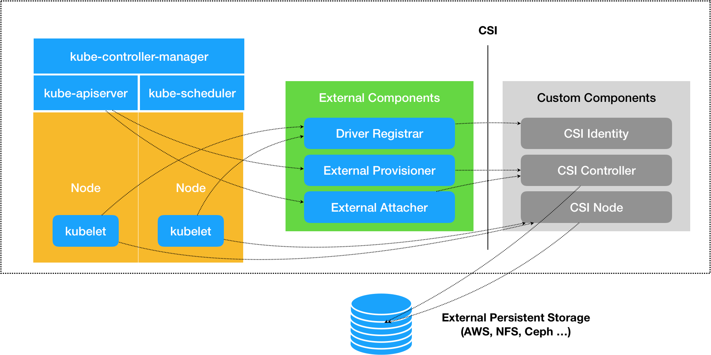

## CSI 基础

这篇文章将主要介绍一下与存储有关的各种资源和用法,并简单介绍创建一个volume到pod挂载的流程已经一个CSI插件需要实现的工能.


#### PV 对象

PV(持久卷)是集群中的一块块存储, 它是一个集群资源.使用一下`YAML`文件便可以创建一个PV资源.

```yaml

apiVersion: v1
kind: PersistentVolume
metadata:
  name: nfs
spec:
  storageClassName: manual
  capacity:
    storage: 1Gi
  accessModes:
    - ReadWriteMany
  nfs:
    server: 10.244.1.4
    path: "/"
```

以上表示我们向`10.244.1.4`这个NFS服务器创建一个挂载目录, 然后在pod模板里面申请将这个NFS目录挂载到本地目录.    对于Kubernetes来说，NFS 这样的存储供应软件已经在kubernetes的核心代码里面实现了,  这也叫做In-Tree 插件. 当然不是所有得存储介质软件kubernetes都要实现一遍, 这便有了后来的Out-Tree插件.


#### PVC 对象

PVC(持久卷申请)表达用户对存储的需求.  PVC不管是如何实现一个存储, 只表达自己的需要. 当集群中有合适的PV出现时,会有一个Controller负责将这两个资源关联到一起. 而这个controller叫做:**PersistentVolumeController**.

一下是如何创建一个PVC资源.

```yaml

apiVersion: v1
kind: PersistentVolumeClaim
metadata:
  name: nfs
spec:
  accessModes:
    - ReadWriteMany
  storageClassName: manual
  resources:
    requests:
      storage: 1Gi
```


> 以上,PV是运维同学需要准备的资源,而开发则需要PVC来描述资源的需求, 具体的组合将由controller来负责.


以上的创建PV,PVC的方式我们称之为静态存储卷. 但是, 如果每次运维和开发人员来写这个YAML文件来满足存储需求肯定是不现实的, 对于一个需要经常使用存储的项目来,这无疑给运维人员带来很大的压力, 这个时候就需要动态的创建PV对象.


动态存储一般指通过存储插件自动的创建PV. 首先, 我们来了解一下跟动态存储有关的资源. 

#### StorageClass

StorageClass(存储类) 像是一个配置文件, 像是描述一个创建PV的模板. 

使用如下的YAML文件可以创建一个SC资源.

```yaml

apiVersion: storage.k8s.io/v1
kind: StorageClass
metadata:
  name: block-service
provisioner: kubernetes.io/gce-pd
parameters:
  type: pd-ssd
```


当您声明一个PVC时，如果在PVC中添加了StorageClassName字段，意味着当PVC在集群中找不到匹配的PV时，会根据StorageClassName的定义触发相应的Provisioner插件创建合适的PV供绑定，即创建动态数据卷。

而 `provisioner` 正式一个提供存储介质的存储供应商,  **kubernetes.io/gce-pd** 表示这个是kubernetes内置的GCE PD 存储. Kubernetes官方大约支持十几种这种 `provisioner`, 然而市面上这种存储提供商太多了,比如 `Aliyun`, `gcloud` 等等,  kubernetes不可能在内部都全面支持, 这也就有了用户可以自定义存储`provisioner`.


如阿里云提供多种SC, 比如他们的普通磁盘, SSD 磁盘, 高效磁盘,NAS等等.

```shell
➜  ~ kubectl get sc
NAME                       PROVISIONER                       RECLAIMPOLICY   VOLUMEBINDINGMODE      ALLOWVOLUMEEXPANSION   AGE
alibabacloud-cnfs-nas      nasplugin.csi.alibabacloud.com    Delete          Immediate              true                   29d
alicloud-disk-available    diskplugin.csi.alibabacloud.com   Delete          Immediate              true                   29d
alicloud-disk-efficiency   diskplugin.csi.alibabacloud.com   Delete          Immediate              true                   29d
alicloud-disk-essd         diskplugin.csi.alibabacloud.com   Delete          Immediate              true                   29d
alicloud-disk-ssd          diskplugin.csi.alibabacloud.com   Delete          Immediate              true                   29d
alicloud-disk-topology     diskplugin.csi.alibabacloud.com   Delete          WaitForFirstConsumer   true                   29d
```


#### CSIDriver 

**CSIDriver** 是kubernetes使用CSI存储体系时引用的一个kubernetes资源, 它在k8s 1.12版本进入Alpha版于1.18正式发布.  引用CSIDriver主要有两个目标:

- 仅同过创建一个CSIDriver对象就可以快速发现注册到集中的 `provisioner`.
- 自定义kubernetes的行为.

阿里云的外部存储也是同过CSI来驱动的,默认阿里云的kubernetes中会有三个CISDriver对象.

```shell
➜  ~ kubectl get csidrivers.storage.k8s.io
NAME                              ATTACHREQUIRED   PODINFOONMOUNT   MODES        AGE
diskplugin.csi.alibabacloud.com   true             true             Persistent   32d
nasplugin.csi.alibabacloud.com    false            true             Persistent   32d
ossplugin.csi.alibabacloud.com    false            true             Persistent   32d
```


#### CSINode

CSINode 主要保存的是安装在Node上的CSIDriver信息, CSIDriver不会直接创建CSINode对象.  而是使用**node-driver-registrar** sidecar 容器,kubelet会自动填充

SCINode对象. CSINode主要用于一下目:

- 映射Node到CSInode对象, 当一个CSIDriver注册以后,CSINode会引用一个Node 名字.
- 驱动可用性,  kubelet 与 kube-controller-manager 和 kubernetes 调度程序通信的一种方式，无论驱动程序在节点上是否可用）
- 卷拓扑, Node的Lable中会存储关于拓扑感知的信息, SCINode中也存储了关于这部分的信息.


CISNode资源其实和Node资源差不多,但CSINode需要存储一些关于CSIdriver的特殊信息,所以也就创建了一个CISNode对象. 和Node一样, 系统中有几个节点,就有几个CISNode资源.

```shell
➜  ~ kubectl get csinodes.storage.k8s.io
NAME                       DRIVERS   AGE
us-west-1.192.168.107.62   3         32d
us-west-1.192.168.107.63   3         32d
us-west-1.192.168.107.64   3         32d
us-west-1.192.168.107.65   3         32d
```


#### VolumeAttachment

**VolumeAttachment** 是一个记录系统中哪个PV应该挂载到哪个Node的资源. 该资源由kubelet创建,并由 [external-attacher](https://kubernetes-csi.github.io/docs/external-attacher.html#csi-external-attacher) 这组件监听并调用驱动程序触发挂载或者卸载的动作.

```yaml
apiVersion: storage.k8s.io/v1
kind: VolumeAttachment
metadata:
  annotations:
    csi.alpha.kubernetes.io/node-id: i-rj957dewp2gadwaobc49
  creationTimestamp: "2021-09-08T09:18:56Z"
  name: csi-b1f522ce14f1b30cd67338f47e3983874714f4c8381a5c01e0b881e83c84f6d3
  resourceVersion: "874944265"
  uid: 3a6227a6-56b3-40a3-8a49-9249f08ef3f5
spec:
  attacher: diskplugin.csi.alibabacloud.com
  nodeName: us-west-1.192.168.107.62
  source:
    persistentVolumeName: d-rj975io66zxshfl6o2n1
status:
  attached: true
```


说完了kubernetes中使用外部存储需要的k8s对象, 我们在来简单介绍一下在CSI组件创建、挂载、Mount 流程.

> 挂载是指将一个Disk挂到某台机器, mount是指机器上的盘如/dev/vdb1 mount 到某个目录. 这个术语后面还会解释.


#### POD挂载Volume流程

下面的流程不是很详细,主要是为了引出每个流程下所需要的组件.

1. 用户创建一个PVC对象, 然后根据PVC中使用的 `storageclasses` 对象调用提供的 provisioner 开始创建磁盘.
2. **[external-provisioner](https://kubernetes-csi.github.io/docs/external-provisioner.html#csi-external-provisioner)** 这个组件会监听到PVC的创建,然后同过RPC来调用**用户写的驱动程序**, 而实际的驱动程序就是在云厂商上创建磁盘.
3. 当一个Pod引用这个PVC时, Pod所在节点的kubelet会创建对应的 `VolumeAttachments` 资源,该资源描述了需要将哪个PV绑定在哪个Node上面.
5. [external-attacher](https://kubernetes-csi.github.io/docs/external-attacher.html#csi-external-attacher) 会监听创建出来的 `VolumeAttachments` 的资源, 同过RPC调用 **用户写的驱动程序** 将磁盘挂载到Node上.
6. kubelet 的 `VolumeManagerReconciler` 控制循环会直接调用**用户写的驱动程序**来完成 Volume 的Mount 阶段.


这里会有一个问题,就是kubernetes如何认识用户提供的CSIDriver呢, 这里还会引出一个组件[CSI node-driver-registrar](https://kubernetes-csi.github.io/docs/node-driver-registrar.html#csi-node-driver-registrar), 由它向kubernetes系统中注册我们实现的各种Driver. 


由此, CSI 容器存储接口的大致流程如上所示, 这里会涉及三个组件 **node-driver-registrar**, **external-provisioner**, **external-attacher**, 和一个用户自己编写的驱动程序. 

1. **node-driver-registrar**, **external-provisioner**, **external-attacher** 目前三个外部组件还是由kubernetes社区维护,对应下图CSI分割线的左侧。

2. 关于用户的驱动程序可以参考阿里云的driver. [alibaba-cloud-csi-driver](https://github.com/kubernetes-sigs/alibaba-cloud-csi-driver) 对应下图的右侧.

大致的流程如下图:



#### CSI 插件功能

一个CSI插件也是一个二进制文件,它以RPC的方式对外提供三个GRPC 服务, 分别叫做**CSI Identify**, **CSI Controller**, **CSI Node**。 

其中，CSI 插件的 CSI Identity 服务，负责对外暴露这个插件本身的信息，如下所示：

```go

service Identity {
  // return the version and name of the plugin
  rpc GetPluginInfo(GetPluginInfoRequest)
    returns (GetPluginInfoResponse) {}
  // reports whether the plugin has the ability of serving the Controller interface
  rpc GetPluginCapabilities(GetPluginCapabilitiesRequest)
    returns (GetPluginCapabilitiesResponse) {}
  // called by the CO just to check whether the plugin is running or not
  rpc Probe (ProbeRequest)
    returns (ProbeResponse) {}
}
```

而 CSI Controller  服务，定义的则是对 Volume（对应 Kubernetes 里的 PV）的管理接口，比如：创建和删除 Volume、对 Volume 进行 Attach/Dettach (在 CSI 的术语里，这个操作被叫作 Publish/Unpublish):

```go

service Controller {
  // provisions a volume
  rpc CreateVolume (CreateVolumeRequest)
    returns (CreateVolumeResponse) {}
    
  // deletes a previously provisioned volume
  rpc DeleteVolume (DeleteVolumeRequest)
    returns (DeleteVolumeResponse) {}
    
  // make a volume available on some required node
  rpc ControllerPublishVolume (ControllerPublishVolumeRequest)
    returns (ControllerPublishVolumeResponse) {}
    
  // make a volume un-available on some required node
  rpc ControllerUnpublishVolume (ControllerUnpublishVolumeRequest)
    returns (ControllerUnpublishVolumeResponse) {}
    

}
```


而 CSI Volume 需要在宿主机上执行的操作，都定义在了 CSI Node 服务里面，如下所示:

```go

service Node {
  // temporarily mount the volume to a staging path
  rpc NodeStageVolume (NodeStageVolumeRequest)
    returns (NodeStageVolumeResponse) {}
    
  // unmount the volume from staging path
  rpc NodeUnstageVolume (NodeUnstageVolumeRequest)
    returns (NodeUnstageVolumeResponse) {}
    
  // mount the volume from staging to target path
  rpc NodePublishVolume (NodePublishVolumeRequest)
    returns (NodePublishVolumeResponse) {}
    
  // unmount the volume from staging path
  rpc NodeUnpublishVolume (NodeUnpublishVolumeRequest)
    returns (NodeUnpublishVolumeResponse) {}
    
  // stats for the volume
  rpc NodeGetVolumeStats (NodeGetVolumeStatsRequest)
    returns (NodeGetVolumeStatsResponse) {}
    
  ...
  
  // Similar to NodeGetId
  rpc NodeGetInfo (NodeGetInfoRequest)
    returns (NodeGetInfoResponse) {}
}
```

以上便是要实现一个CSI需要实现的所有工能. 后面我会以aliyun的 [alibaba-cloud-csi-driver](https://github.com/kubernetes-sigs/alibaba-cloud-csi-driver) 详细的讲解每一部分.